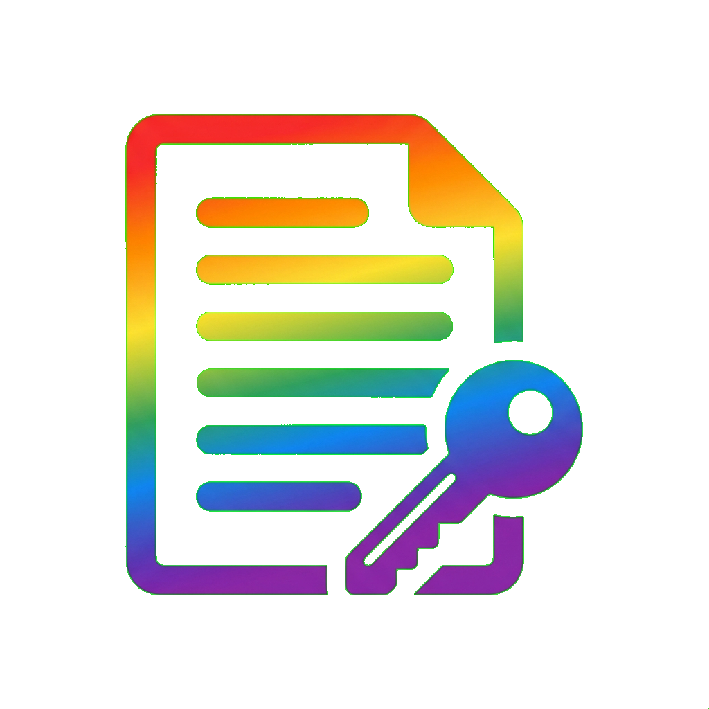

# Parameter Store Explorer

<p align="center">
  
</p>

A modern desktop application for exploring and managing AWS Systems Manager Parameter Store. Built with Electron, Next.js, and TypeScript.

## Features

- 🔐 **AWS Profile Support** - Use your existing AWS profiles and credentials
- 🔍 **Search & Filter** - Quickly find parameters with real-time search
- 📝 **CRUD Operations** - Create, view, edit, duplicate, and delete parameters
- 🔒 **SecureString Support** - Full support for encrypted parameters
- 🌙 **Dark Mode** - Beautiful dark theme interface
- 🔄 **SSO Integration** - AWS SSO login support

## Installation

### Pre-built Releases

Download the latest release for your platform from the [Releases](https://github.com/kirkbackus/parameter-store-explorer/releases) page.

### From Source

```bash
# Clone the repository
git clone https://github.com/kirkbackus/parameter-store-explorer.git
cd parameter-store-explorer

# Install dependencies
npm install

# Run in development mode
npm run dev

# Build for production
npm run build
```

## Requirements

- **AWS CLI** configured with at least one profile
- **Node.js** 18+ (for development)

## Usage

1. Launch the application
2. Select an AWS profile from the dropdown
3. Browse parameters in the sidebar
4. Click a parameter to view its details
5. Use the action buttons to edit, duplicate, or delete parameters

### Creating Parameters

Click the **"+ Add Parameter"** button in the sidebar to create a new parameter. Supported types:
- **String** - Plain text values
- **StringList** - Comma-separated values
- **SecureString** - Encrypted values using AWS KMS

## Development

```bash
# Start development server
npm run dev

# Build for production
npm run build

# Run electron directly
npm start
```

## Tech Stack

- **Electron** - Desktop application framework
- **Next.js** - React framework for the renderer
- **TypeScript** - Type-safe JavaScript
- **Tailwind CSS** - Utility-first CSS framework
- **AWS SDK v3** - AWS service integration
- **Radix UI** - Accessible UI components
- **Framer Motion** - Animation library

## License

MIT License - Kirk Backus
